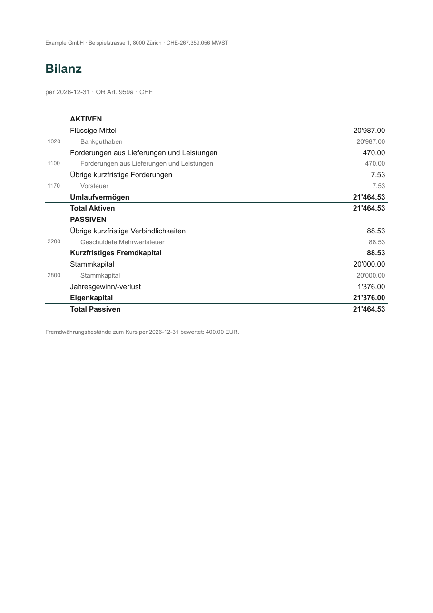

# quints

[](https://github.com/sealambda/quints/actions/workflows/ci.yml)
[](https://pypi.org/project/quints/)
[](https://sealambda.github.io/quints/)

Plain-text accounting for Swiss micro-companies, on top of
[beancount](https://github.com/beancount/beancount) and
[Fava](https://github.com/beancount/fava).

Swiss VAT (MWST) returns, Bezugsteuer, QR-bill invoicing, statutory KMU
statements, and official BAZG FX rates — the things a Swiss micro-company
(GmbH, AG, or Einzelfirma) actually has to do, on a ledger you own as text.
There's no incumbent for this niche, and
`quints` is built to be **driven by an AI coding agent** (Claude Code, Codex,
…): it's a deterministic CLI with machine-readable output, so the agent
proposes bookings and `quints` checks and reports on them — it never calls a
model itself.


**Docs: [sealambda.github.io/quints](https://sealambda.github.io/quints/)** —
every command shown there is executed by the test suite.

## Install

```bash
uv tool install quints        # or: pipx install quints  /  pip install quints
quints --help
```

Needs Python 3.10+ (uv installs it for you if missing). Typst — for the PDFs —
and everything else come bundled; nothing more to install.

## Quick start

Scaffold a project with a sample quarter already booked, and run against it:

```bash
quints init my-books --samples --yes   # drop --yes to answer the questionnaire
cd my-books
quints mwst -q 2026-Q3
```

`quints init` writes a runnable project: a Swiss KMU chart of accounts in
`accounts.bean` (every account mapped to its Kontenrahmen code), transactions
in `books/<year>.bean` (one file per fiscal year), a `quints.toml`, a
`pyproject.toml` (after `uv sync`, the plain beancount toolchain —
`bean-check main.bean`, `fava main.bean` — works too), and an `AGENTS.md`
that tells a coding agent how to extend the books and validate them with
`quints check`. Drop `--samples` for empty books.

It asks for your legal form — `gmbh`, `ag`, or `einzelfirma` (sole
proprietorship / freelancer) — and scaffolds the matching equity block from
the official KMU Kontenrahmen: share capital for a GmbH/AG; owner's equity,
capital contributions, and the Privat account for an Einzelunternehmen. The
account namespace follows (`:CH:GmbH:`, `:CH:AG:`, `:CH:Einzelfirma:`).
Everything entity-specific (name, VAT registration, account names, importer
rules) is configuration; VAT *rates* are law and ship date-ranged in code.

## What it does — by the job

Run these from your project directory; with `--samples` they work out of the box.

### File your quarterly Swiss VAT (MWST)

```bash
quints mwst -q 2026-Q3    # Form-310 Ziffern, mapped to the ESTV return
quints status             # VAT filed but not yet paid, with due dates
```

### See who owes you

```bash
quints receivables        # open invoices, aged by due date
```


### Year-end statements for your Treuhänder / auditor

```bash
quints report bilanz --at 2026-12-31             # balance sheet (OR Art. 959a)
quints report erfolg --year 2026                 # income statement (OR Art. 959b)
quints report statements --year 2026 --lang de   # both, as one PDF
```




### Keep FX rates right

<!-- no-test: prices sync needs network; fx revalue is covered by docs/guides/fx.md -->
```bash
quints prices sync                    # official BAZG/EZV daily CHF rates (needs network)
quints fx revalue --at 2026-12-31     # year-end revaluation entry to paste (Art. 960 OR)
```

### Draft bank / PSP statements into a review area

```bash
quints import ubs <statement.mt940>   # → staging/, never straight into your books
```

Wise and Stripe importers exist too (`import wise` / `import stripe`, with
`--fetch` to pull from their APIs). Drafts land in `staging/` flagged for the
VAT decision + a linked document; nothing reaches your books until you review it.

### Send a Swiss QR-bill invoice

```bash
quints invoice <invoice.yaml>         # QR-bill PDF, cross-checked against the ledger
```

Renders a QR-bill PDF (domestic or export / reverse-charge) and reconciles the
total against the matching booking in your ledger, so an invoice can't silently
diverge from your books.


> **Ready-to-run samples:** the repo's
> [`packages/quints/examples/`](packages/quints/examples) ships a working
> `invoicing/` and `statements/` set. Clone the repo, `cd` in, and try
> `quints invoice invoicing/acme-2026-07.yaml` and
> `quints import ubs statements/ubs-2026.mt940`.

## The building blocks

`quints` is assembled from standalone distributions, each useful on its own in
any beancount setup. They all live in this repo and are all published to PyPI —
installing `quints` pulls them in.

| Package | What it does |
|---|---|
| [`quints`](packages/quints) | Swiss VAT (MWST) reports & settlement, Bezugsteuer helpers, QR-bill invoicing, KMU statutory statements (OR Art. 959a/959b), statement importing into a review staging area, Fava extension |
| [`beangulp-mt940`](packages/beangulp-mt940) | beangulp importer for SWIFT MT940 bank statements (UBS et al.) |
| [`beangulp-wise`](packages/beangulp-wise) | beangulp importer for Wise balance statements, with an SCA-capable API client |
| [`beangulp-stripe`](packages/beangulp-stripe) | beangulp importer for Stripe balance transactions, with a thin API client |
| [`beanprice-bazg`](packages/beanprice-bazg) | beanprice source for official Swiss BAZG/EZV daily FX rates |

## Development

```bash
git clone https://github.com/sealambda/quints
cd quints
uv sync
make check     # ruff, basedpyright, import-linter, deptry, vulture, pytest
```

`make check` is the whole quality gate; CI runs exactly it. Pushing a `vX.Y.Z`
tag builds and publishes all five distributions to PyPI (trusted publishing). See
[CONTRIBUTING.md](CONTRIBUTING.md) for the architecture and conventions.
