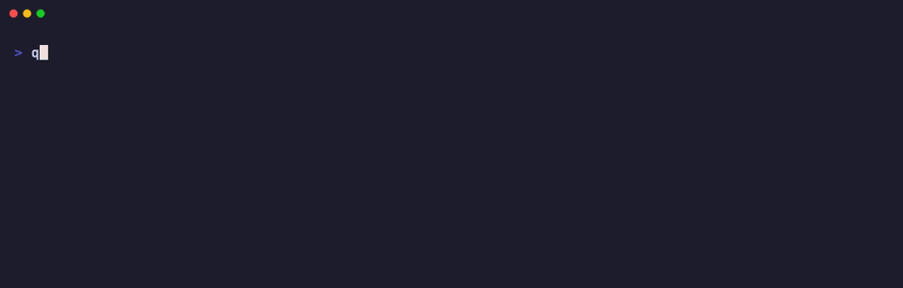
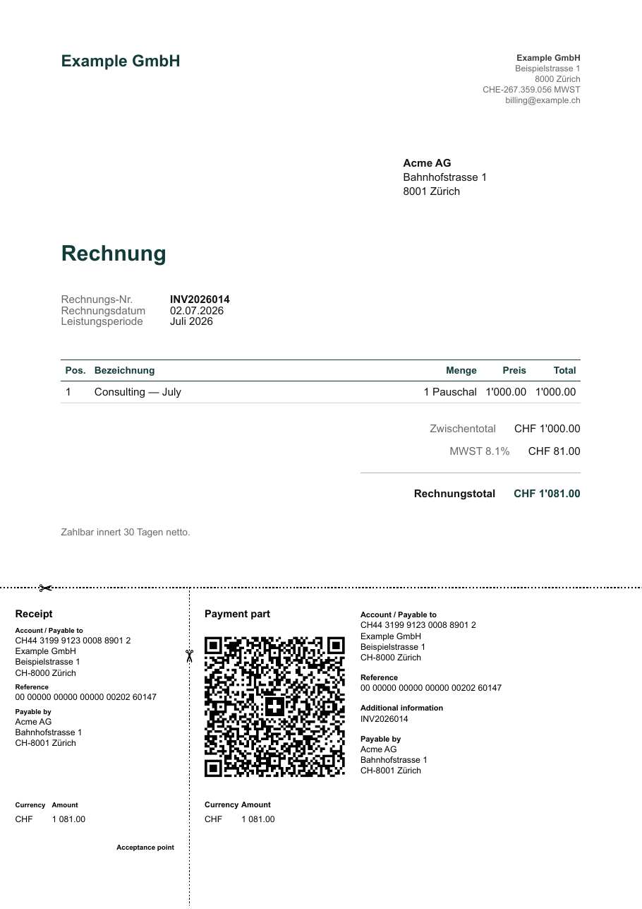
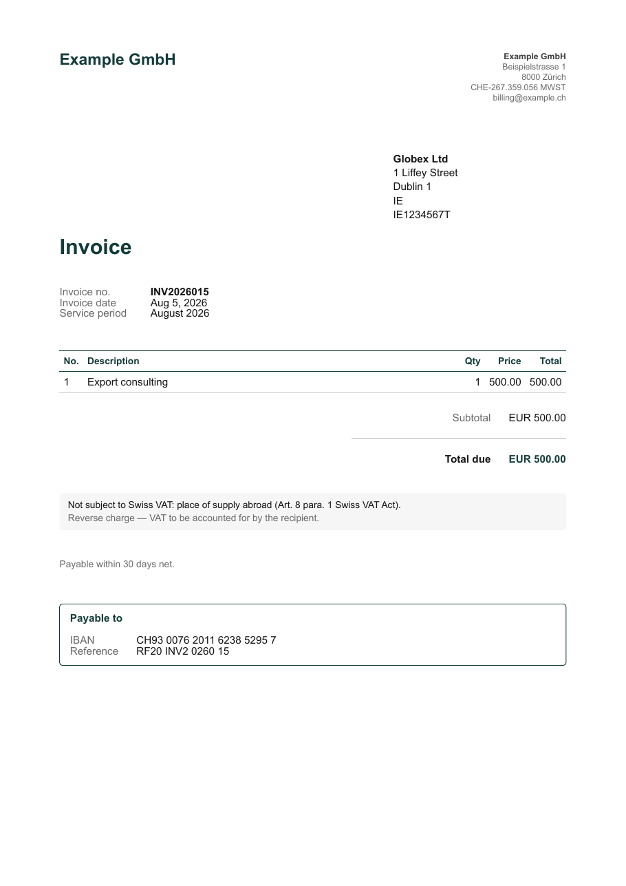

# Invoicing

## Render a QR-bill

```bash
quints invoice invoicing/acme-2026-07.yaml
```

Writes a Swiss QR-bill PDF (domestic, or export/reverse-charge without QR
part) and cross-checks the total against your ledger: if the invoice is
already booked at a different amount, you get a conflict, not a silent
divergence. If it isn't booked yet, quints prints the draft transaction to
paste into `books/<year>.bean`.

The PDF is filed the way beancount documents are filed — under the income
account's folder, date-prefixed, so `option "documents"` and Fava pick it up:

```text
documents/Income/CH/GmbH/Consulting/External/Domestic/2026-07-02.acme-ag.INV2026014.pdf
```

`--out` overrides the location when you need to.



{ width="480" }

An invoice is one YAML file:

```yaml
number: INV2026014
kind: domestic          # or export (reverse charge, no QR part)
currency: CHF
issue_date: 2026-07-02
supply: Juli 2026
customer:
  name: Acme AG
  address:
    - Bahnhofstrasse 1
    - 8001 Zürich
items:
  - description: Consulting — July
    quantity: 1
    unit_price: 1000.00
locale: de_CH
```

Issuer identity — name, address, VAT ID, IBAN/QR-IBAN per currency, logo —
lives once in `invoicing/issuer.yaml`. Repeat customers can live in
`invoicing/customers.yaml` and be referenced by key (`customer: acme`).

## Foreign invoices

```bash
quints invoice invoicing/globex-2026-08.yaml
```

An export invoice (`kind: export`) renders without a QR part — it shows the
regular IBAN for a SEPA/international transfer instead — and defaults to the
EU B2B reverse-charge note, which requires the customer's VAT number in the
registry. Set `reverse_charge: false` for customers outside a reverse-charge
regime (e.g. US).

{ width="480" }

A project scaffolded with `quints init --samples` includes both flavours:
`invoicing/acme-<year>-07.yaml` (domestic QR-bill) and
`invoicing/globex-<year>-08.yaml` (EUR export), each tied to a booking in the
sample quarter so the cross-check reconciles.

## Editor validation

The invoice, issuer, and customers files have JSON Schemas, published with
this site at
[`/quints/schema/`](https://sealambda.github.io/quints/schema/invoice.schema.json).
Scaffolded YAMLs already carry the matching `yaml-language-server: $schema=`
modeline, so schema-aware editors (and agents) validate fields as you type.
To work offline:

```bash
quints schema
```

writes the same schemas to `invoicing/schema/`.

## Who owes you

```bash
quints receivables
```

Open invoices against `Receivable:Trade`, grouped by invoice id, aged by due
date. An invoice disappears from the list when the payment leg is booked with
the same `^invoice-id` link.


