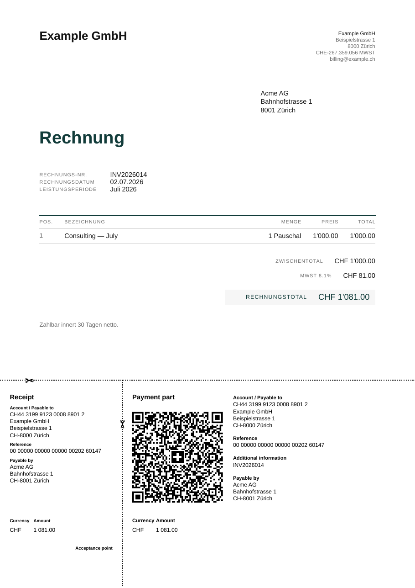
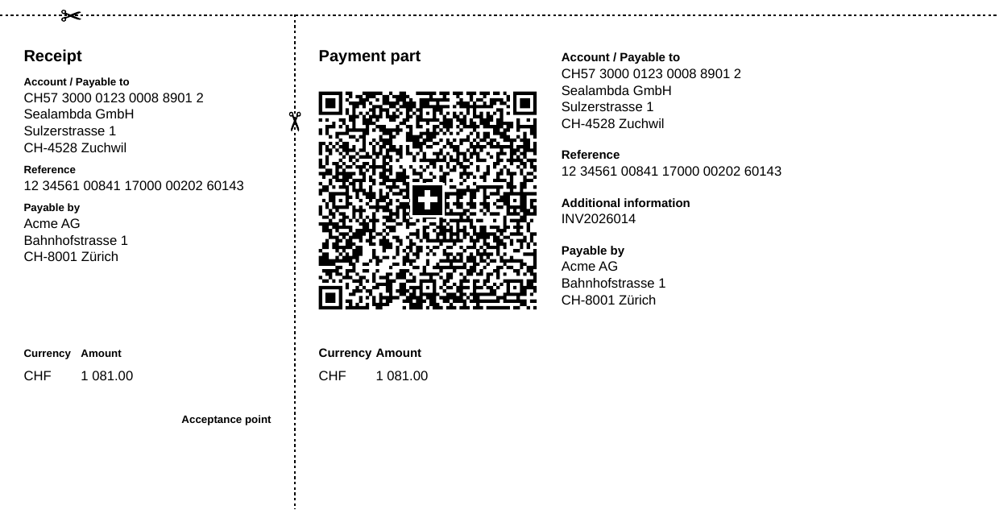
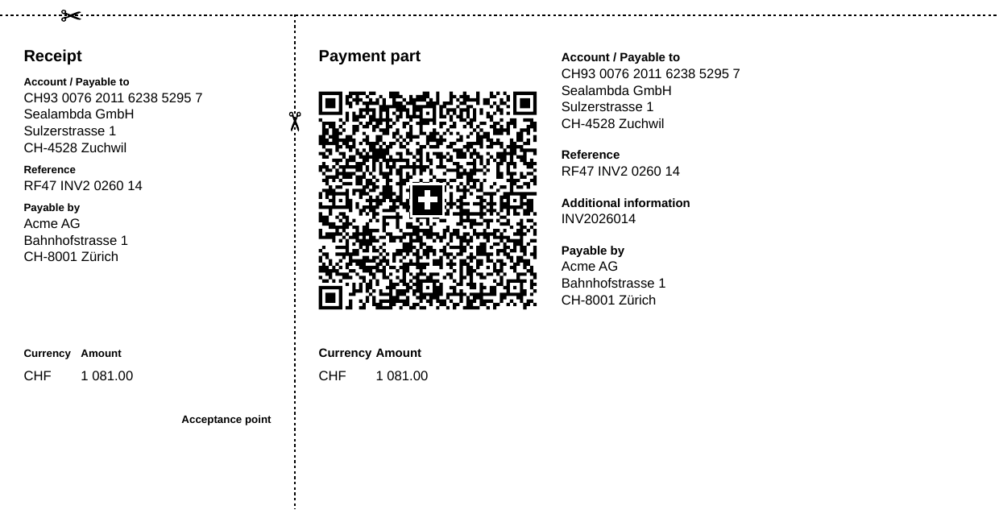
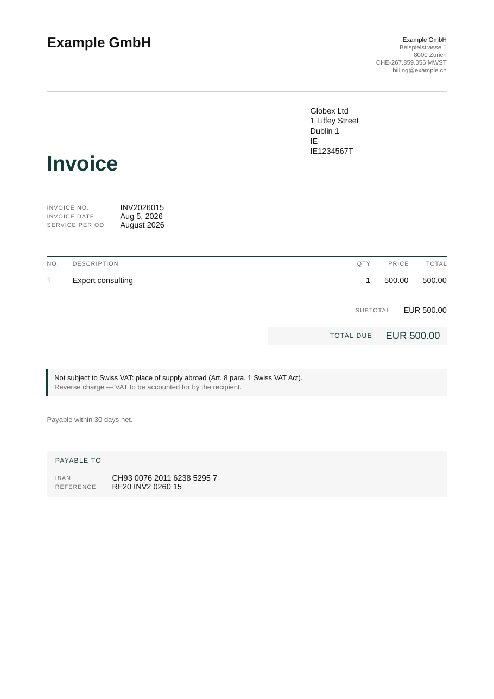

# Invoicing

Write the invoice as one YAML file, render it, and paste the booking it
prints. quints produces the QR-bill PDF, checks it against the ledger, and
later matches the payment to it.

!!! abstract "Applies if"
    - **Legal form:** Einzelfirma, GmbH or AG. Same steps for all three.
    - **VAT status:** registered or not. quints reads it from `quints.toml`
      for the invoice's issue date.
        - *Registered:* the domestic invoice charges VAT.
        - *Not registered:* it charges and mentions none — see
          [below](#not-vat-registered).
    - **Invoices:** domestic Swiss QR-bills in CHF or EUR, and export
      invoices (SEPA/SWIFT, EU reverse charge).
    - **Not covered:** e-invoicing formats (ZUGFeRD, Peppol), credit notes as
      separate documents, instalment plans.

## Render a QR-bill

```bash
quints invoice invoicing/acme-2026-07.yaml
```

Writes a Swiss QR-bill PDF (domestic, or export/reverse-charge without QR
part) and cross-checks the total against your ledger: if the invoice is
already booked at a different amount, you get a conflict, not a silent
divergence. If it isn't booked yet, quints prints the draft transaction to
paste into `books/<year>.bean`.

The PDF is filed the way beancount documents are filed — under the income
account's folder, date-prefixed, so `option "documents"` and Fava pick it up:

```text
documents/Income/CH/GmbH/Consulting/External/Domestic/2026-07-02.acme.INV2026014.pdf
```

The customer part is the registry key from `customers.yaml` (the slugified
name for inline customers). `--out` overrides the location when you need to.


{ width="480" }

An invoice is one YAML file:

```yaml
number: INV2026014
kind: domestic          # or export (reverse charge, no QR part)
currency: CHF
issue_date: 2026-07-02
supply: 2026-07          # the supply period — see below
customer:
  name: Acme AG
  address:
    - Bahnhofstrasse 1
    - 8001 Zürich
items:
  - description: Consulting — July
    quantity: 1
    unit_price: 1000.00
locale: de_CH
```

Issuer identity — name, address, VAT ID, bank details per currency, logo —
lives once in `invoicing/issuer.yaml`. Repeat customers can live in
`invoicing/customers.yaml` and be referenced by key (`customer: acme`).

## Supply period

`supply` says when the work was done or the goods delivered, and every invoice
needs one. It takes one of three forms:

```yaml
supply: 2026-07                              # a calendar month
supply: 2026-07-15                           # a single day
supply: {from: 2026-07-01, to: 2026-09-30}   # any period, both days included
```

It is printed under *Leistungsperiode* / *Service period* in the invoice's
locale (`Juli 2026`, `15.07.2026`, `1. Juli – 30. Sept. 2026`). On a QR-bill it
also goes into the billing information as Swico `/31/` (see
[below](#your-customers-references)), so the payer's software books the input
tax in the right VAT period without anyone retyping it.

The law asks for this date. A Swiss invoice has to state the date or period
of the supply,[^supply-ch] and an EU invoice has to state the date the supply
was made or completed if it differs from the invoice date.[^supply-eu] An
invoice that goes out on the day of the supply could skip it, but quints asks
for it every time. A stated date is never wrong, and the payer's VAT booking
relies on it.

Free text is refused. `supply: Juli 2026` fails at load, and the error names
the value to write instead (`supply: 2026-07`), so older invoice files are a
one-line fix. The ledger draft still reads `Juli 2026 invoiced`.

## Bank details

One account per invoicing currency, under `bank`:

```yaml
bank:
  CHF:
    iban: CH93 0076 2011 6238 5295 7     # the account invoices are paid into
    bic: POFICHBEXXX
    bank_name: PostFinance AG, Bern      # optional
    # reference: qrr                     # see "Payment reference" below
    # qr_iban: CH57 3000 0123 0008 8901 2
    # qr_reference_id: "123456"          # the six digits your bank assigns you
  EUR:
    iban: DE89 3704 0044 0532 0130 00
    bic: COBADEFFXXX
    bank_name: Commerzbank AG, Köln
    holder: Example GmbH                 # optional — if not the issuer
```

Every IBAN is checked at load (length, national layout, mod-97 check digits)
and every BIC against ISO 9362, so a transposed digit fails before the PDF
exists rather than after it was sent.

**`bic` is mandatory for any currency you invoice abroad in.** An export
invoice refuses to render without one: it goes on the PDF as `BIC/SWIFT`,
next to the beneficiary and the bank's name, so the payer copies it instead
of looking one up — a guessed BIC is how a SEPA transfer comes back. quints
never derives it from the IBAN: that mapping lives in a bank registry that
changes, and a wrong-but-plausible BIC would be worse than none. Ask the bank
that holds the account.

To check a pair before it ships — or every account in the issuer config:

```bash
quints iban "DE89 3704 0044 0532 0130 00" --bic COBADEFFXXX
quints iban
```

It reports the country, the institution (IID) for Swiss and Liechtenstein
IBANs, and flags a BIC whose country doesn't match the IBAN's — normal for a
payment provider (a Wise EUR account is a Belgian IBAN), wrong if you pasted
another account's code. It exits non-zero when something is off, so it fits a
pre-flight check.

## Payment reference

Every invoice asks to be paid with a structured reference, so the payment
arrives carrying its own invoice id. Switzerland has two, each tied to a
different kind of bank account, and quints picks the Swiss-native one whenever
your account can carry it:

**QRR** — the Swiss QR reference, paid into a **QR-IBAN**. The payer's bank
refuses any payment to a QR-IBAN without a valid reference, so every payment
that reaches you is matchable. It is numeric — quints encodes the invoice
number so its digits stay visible at the end — and CHF-only. An account with a
`qr_iban` uses it for CHF QR-bills without further ado; add the six-digit
identification your bank assigns you, and keep the regular `iban` for CHF from
abroad:

```yaml
bank:
  CHF:
    qr_iban: CH57 3000 0123 0008 8901 2
    qr_reference_id: "123456"   # quoted: YAML reads a leading zero as octal
    iban: CH93 0076 2011 6238 5295 7
```

**SCOR** — the ISO 11649 Creditor Reference, paid into the regular **IBAN**.
`RF`, two check digits, then the invoice number itself:

```text
RF47 INV2 0260 14
```

Readable on a bank statement, quotable in a reminder email, valid on a Swiss
QR-bill in CHF and EUR *and* in a SEPA transfer. It is what an account without
a `qr_iban` uses, what every QR-bill in EUR uses, and what every export invoice
uses. Prefer it although you have a QR-IBAN? Say so:

```yaml
bank:
  CHF:
    reference: scor
    qr_iban: CH57 3000 0123 0008 8901 2
    iban: CH93 0076 2011 6238 5295 7
```

The same invoice under each scheme — the payment part is what the customer
scans or retypes. With a QR-IBAN and the bank's identification, a QR
reference whose tail is the invoice's own digits:



With the regular IBAN, a creditor reference that spells the invoice number out:



[**Payment references**](payment-references.md) covers the whole picture — the
three types the standard defines, the exact pairing rules with their
citations, what the QR reference contains, how to choose, and how a payment
finds its way back to the invoice.

The reference is derived from the invoice number and nothing else, which is
what lets `quints import` and `quints match` credit an incoming payment to
its invoice — by the reference it quotes, the plain number, or a QR reference
decoded back into one. Two invoices never share a reference as long as their
numbers differ in a letter or digit: case and punctuation are not carried, so
`INV-014` and `INV014` would collide (the matcher then reports the payment as
ambiguous instead of guessing). A number too long to encode is refused instead
of truncated, because a truncated reference is a payment credited to somebody
else's invoice. `quints invoice` prints the reference it used:

```text
ref SCOR RF47 INV2 0260 14
```

Set `reference:` on the *invoice* only to re-issue one that went out with a
reference from elsewhere — it is validated by its check digits at load, and
refused if it doesn't match the account's scheme.

## Your customer's references

Accounts-payable departments pay against their own numbers.
`customer_reference` is their PO or order number; `references` is the long
tail — a Leitweg-ID, a CIG/CUP, a cost centre, a framework contract:

```yaml
number: INV2026014
customer: acme
customer_reference: PO-2026-118
references:
  - label: Leitweg-ID
    value: 991-12345-67
  - label: Kostenstelle
    value: KST-4711
```

Both are printed next to the invoice number and date, on domestic and export
invoices alike, with `customer_reference` labelled in the invoice's language
("Ihre Referenz" / "Your reference" / "Su referencia") and the extras labelled
exactly as you wrote them. `customer_reference` also lands in the ledger draft
as `customer_reference:` metadata, so the books can be searched by the number
the customer quotes.

On a QR-bill it additionally travels in the structured *billing information*
element, in Swico's S1 syntax:[^s1]

```text
//S1/10/INV2026014/11/260702/20/PO-2026-118/30/267359056/31/260701260731/32/8.1/40/0:30
```

That is the invoice number, its date, your customer's reference, your UID, the
supply period (`/31/`, first and last day as `YYMMDD`; a single day is one
date), the VAT rate and the payment terms — machine-readable for the payer's
accounts-payable software. Banks do not forward it with the payment; what comes
back to you is the reference and the unstructured message, which carries the
invoice number.

## Branding

The PDF's typography and palette come from the `brand` block in
`issuer.yaml`. Three font roles are separate on purpose:

```yaml
brand:
  font: Geist              # body copy
  font_display: Newsreader # the title
  font_mono: Geist Mono    # every figure, IBAN and reference
  font_dir: invoicing/fonts # optional — ship your own families
  accent: "#6b1f4a"        # title, amount due, leading rules
  logo: invoicing/wordmark.svg
  logo_height: 9           # mm
```

`font_mono` is what keeps amount columns aligned on the digit — point it at
any monospace (or a face with tabular figures; the template requests them
either way). All the values above are also the defaults: the three families
ship with quints, so an issuer that configures nothing still renders
identically on every machine. Set `font_dir` to use families of your own;
that also switches machine-installed fonts off, so a designer's locally
installed variable font can never change how the same invoice renders
elsewhere. The full token list (ink, subtle, rule, panel, display weight and
stretch) is in the [issuer schema](https://sealambda.github.io/quints/schema/issuer.schema.json).

## Not VAT-registered

A business that isn't registered must not show VAT on its invoices. If it
does, it owes the VAT it showed.[^art27] quints takes the status from
`quints.toml` for the invoice's **issue date**: `vat_registered = false`, or
a date before `vat_registered_since` or after `vat_registered_until`. For such
an invoice, quints leaves out:

- the VAT row: the total is the net amount;
- the Swiss export note on an export invoice;
- the VAT number (`/30/`) and rate (`/32/`) in the QR-bill's billing
  information;
- the OutputVAT leg in the ledger draft.

The issuer's `vat_id` has to match:

- **Registered:** the VAT number is required on every invoice, e.g.
  `CHE-123.456.789 MWST`.[^vat-id]
- **Not registered:** leave `vat_id` out, or give the bare UID without the
  `MWST`/`TVA`/`IVA` suffix. quints refuses to render an invoice from an
  unregistered issuer whose `vat_id` reads as a VAT number.

The day registration starts, the next invoice charges VAT, with no change to
the invoice files. Invoices dated before that day keep rendering without VAT,
so a re-render reproduces what was sent.

## Foreign invoices

```bash
quints invoice invoicing/globex-2026-08.yaml
```

An export invoice (`kind: export`) renders without a QR part. It shows the
full SEPA/international payment instruction instead (beneficiary, IBAN,
BIC/SWIFT, bank, reference) and the Swiss note that the place of supply is
abroad.[^place] It defaults to the EU B2B reverse-charge note, which requires
the customer's VAT number in the registry.[^reverse] Set
`reverse_charge: false` for customers outside a reverse-charge regime (e.g.
the US). The currency's account needs both a regular `iban` (a QR-IBAN can't
receive an ordinary credit transfer) and a `bic`.

{ width="480" }

A project scaffolded with `quints init --samples` includes both flavours:
`invoicing/acme-<year>-07.yaml` (domestic QR-bill) and
`invoicing/globex-<year>-08.yaml` (EUR export), each tied to a booking in the
sample quarter so the cross-check reconciles.

## Editor validation

The invoice, issuer, and customers files have JSON Schemas, published with
this site at
[`/quints/schema/`](https://sealambda.github.io/quints/schema/invoice.schema.json).
Scaffolded YAMLs already carry the matching `yaml-language-server: $schema=`
modeline, so schema-aware editors (and agents) validate fields as you type.
To work offline:

```bash
quints schema
```

writes the same schemas to `invoicing/schema/`.

## Who owes you

```bash
quints receivables
```

Open invoices against `Receivable:Trade`, grouped by invoice id, aged by due
date. An invoice disappears from the list when the payment leg is booked with
the same `^invoice-id` link.

Each invoice shows in its own currency; below the per-currency totals a
consolidated total converts everything at the latest rate in your price file
(`≈ Total CHF`). It consolidates in the operating currency by default —
`--in EUR` picks another. A currency with no rate is excluded and called out;
`quints prices sync` fixes that.


## What quints doesn't do here

- **Send the invoice.** quints writes the PDF; mailing it is yours.
- **E-invoicing formats** (ZUGFeRD/Factur-X, Peppol, EDIFACT).
- **Several VAT rates on one invoice.** The rate is per invoice (`vat.rate`),
  not per line.
- **Derive a BIC from an IBAN.** Ask the bank. A guessed BIC is worse than
  none.

[^supply-ch]: Art. 26 Abs. 2 Bst. c MWSTG, [SR 641.20](https://www.fedlex.admin.ch/eli/cc/2009/615/de#art_26).
[^supply-eu]: Art. 226 point (7) of the VAT Directive 2006/112/EC: "the date on which the supply … was made or completed … in so far as that date can be determined and differs from the date of issue". [EUR-Lex](https://eur-lex.europa.eu/legal-content/EN/TXT/?uri=CELEX:02006L0112-20250414).
[^art27]: Art. 27 Abs. 1 and 2 MWSTG: "Wer nicht im Register der steuerpflichtigen Personen eingetragen ist …, darf in Rechnungen nicht auf die Steuer hinweisen"; who shows it anyway "schuldet die ausgewiesene Steuer". [fedlex](https://www.fedlex.admin.ch/eli/cc/2009/615/de#art_27).
[^vat-id]: Art. 26 Abs. 2 Bst. a MWSTG: the invoice names the issuer "sowie die Nummer, unter der er oder sie eingetragen ist". The `MWST` suffix format is the one in [MWST-Info 16, Ziff. 2.2](https://www.gate.estv.admin.ch/mwst-webpublikationen/public/pages/taxInfos/cipherDisplay.xhtml?publicationId=1002536&componentId=1002626).
[^place]: Art. 8 Abs. 1 MWSTG (place of supply of services: where the recipient has its seat), [fedlex](https://www.fedlex.admin.ch/eli/cc/2009/615/de#art_8).
[^reverse]: Art. 44 and 196 of the VAT Directive (place of supply and reverse charge for B2B services), Art. 226 points (4) and (11a) (the customer's VAT number and the "Reverse charge" mention). [EUR-Lex](https://eur-lex.europa.eu/legal-content/EN/TXT/?uri=CELEX:02006L0112-20250414).
[^s1]: Swico, [*Syntaxdefinition der Rechnungsinformationen (S1) bei der QR-Rechnung*, Version 1.2, 23.11.2018](https://www.swico.ch/media/filer_public/20/76/2076a19a-a017-438a-bc9a-73b1a5980d00/v2_qr-bill-s1-syntax-de.pdf). SIX has taken over the definition and reproduces it in Anhang D of the [Swiss Implementation Guidelines QR-bill 2.4](https://www.six-group.com/dam/download/banking-services/standardization/qr-bill/ig-qr-bill-v2.4-de.pdf).
