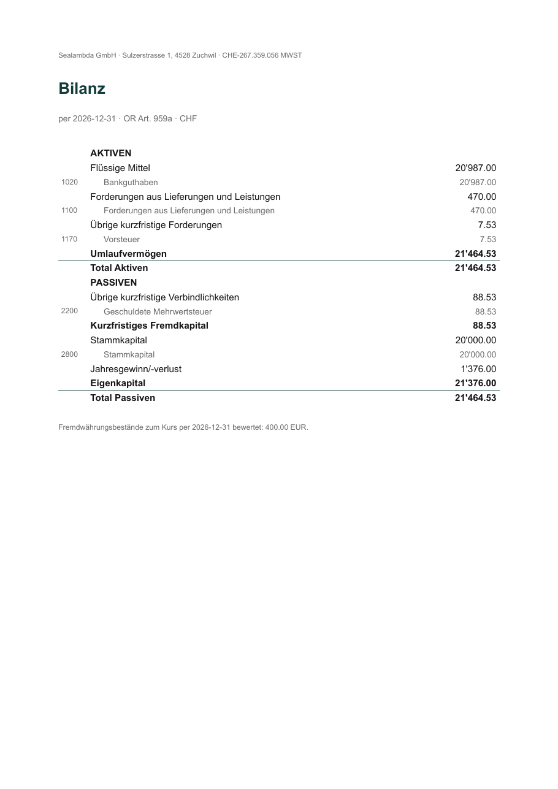

# Statutory reports

The balance sheet and income statement your Treuhänder, the tax office and,
for a GmbH or AG, the shareholders' meeting need, grouped the way the law
lays them out.[^structure] quints groups your accounts by the `kmu:` codes
on their `open` directives, which is why `quints check` insists on the
codes.

!!! abstract "Applies if"
    - **Legal form:** Einzelfirma, GmbH or AG. The equity section is labelled
      for the form: Eigenkapital, Stammkapital or Aktienkapital.
    - **VAT status:** any. VAT balances appear as receivables or liabilities
      like any other.
    - **Not covered:** consolidated accounts, the notes to the accounts
      (Anhang, Art. 959c OR), a cash-flow statement, and the larger
      companies' additional reporting (Art. 961 ff. OR).

## Balance sheet and income statement

```bash
quints report bilanz --at 2026-12-31
quints report erfolg --year 2026
```

`bilanz` values non-CHF balances at the report-date rate (same method Fava
uses, so totals tie out) and splits the balancing figure into
Gewinnvortrag and the current year's result. `erfolg` converts flows at each
transaction's date. Both take `--from/--to` for arbitrary periods.

The equity section is labeled for your [legal form](../legal-forms.md):
Eigenkapital, Stammkapital, or Aktienkapital.

## Auditor detail

```bash
quints report konten --year 2026
```

Kontoblätter: per-KMU-code transaction listings — every booking behind every
statement line. This is what your Treuhänder asks for when a number looks off.

## The PDF for your Treuhänder

```bash
quints report statements --year 2026 --lang de
```

Bilanz + Erfolgsrechnung as one PDF, in German (`--lang de`) or English,
with your issuer identity from `invoicing/issuer.yaml` on it. `--out` picks
the path.

{ width="480" }

All report commands take `--lang` and `--json`.

Before the statements are final, run the year-end checklist:
[Close the year](year-end.md).

## What quints doesn't do here

- **The Anhang (notes).** Write it with your Treuhänder. The Kontoblätter
  (`quints report konten`) are the detail behind it.
- **Profit appropriation** and the shareholders' approval (GmbH/AG).
- **The tax return.** The statements are its input, not the return.

[^structure]: Minimum structure of the balance sheet and income statement: Art. 959a and 959b OR, [SR 220](https://www.fedlex.admin.ch/eli/cc/27/317_321_377/de#art_959_a). The account codes follow the Schweizer Kontenrahmen KMU, edition 2023 ([SwissAccounting](https://swissaccounting.org/kontenrahmen)).
